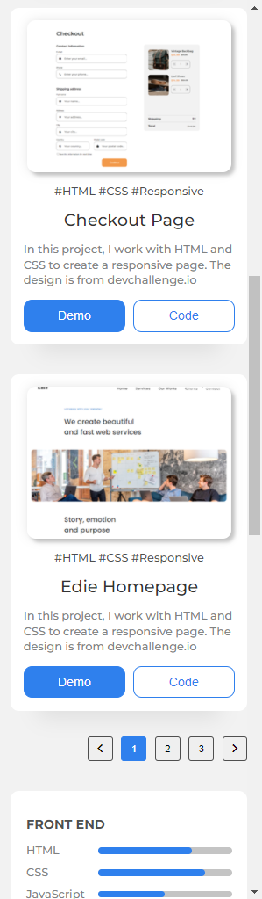
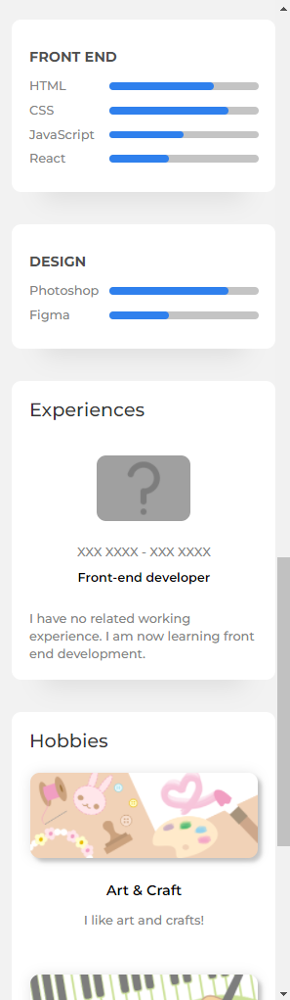
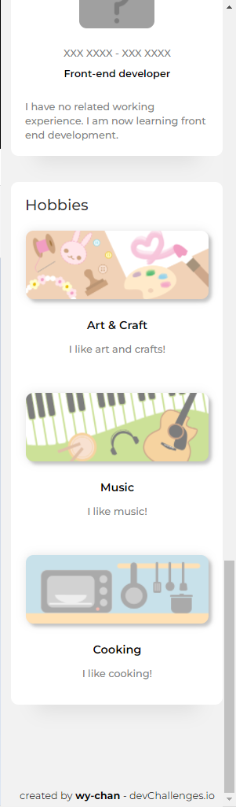
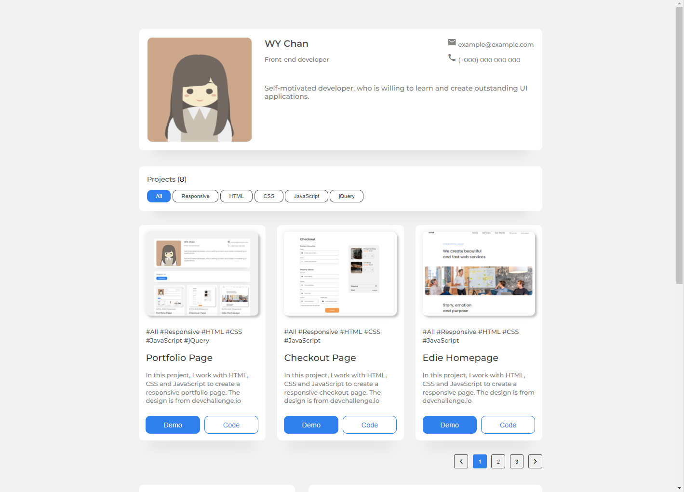

<!-- Please update value in the {}  -->

<h1 align="center">Portfolio</h1>

   Solution for a challenge from  <a href="http://devchallenges.io" target="_blank">Devchallenges.io</a>.

  <h3>
    <a href="https://wy-chan.github.io/devchallenges_Portfolio">
      Demo
    </a>
     | 
    <a href="https://github.com/wy-chan/devchallenges_Portfolio">
      Solution
    </a>
     | 
    <a href="https://devchallenges.io/challenges/5ZnOYsSXM24JWnCsNFlt">
      Challenge
    </a>
  </h3>

<!-- TABLE OF CONTENTS -->

## Table of Contents

- [Overview](#overview)
  - [Built With](#built-with)
- [Features](#features)
- [How to use](#how-to-use)
- [Contact](#contact)
- [Acknowledgements](#acknowledgements)

<!-- OVERVIEW -->

## Overview

&nbsp;&nbsp;
&nbsp;&nbsp;
&nbsp;&nbsp;
&nbsp;&nbsp;

See demo here: https://wy-chan.github.io/devchallenges_RecipePage/

I created a page based on the given design. This challenge helps me to learn more about checkbox and lists(ordered list/ unordered list).

### Built With

- HTML
- CSS

## Features

<!-- List the features of your application or follow the template. Don't share the figma file here :) -->

This application/site was created as a submission to a [DevChallenges](https://devchallenges.io/challenges) challenge. The [challenge](https://devchallenges.io/challenges/5ZnOYsSXM24JWnCsNFlt) was to build an application to complete the following user stories:

- [x] User story: I can see personal details
- [x] User story: I can see skills
- [x] User story: I can see projects
- [x] User story: I can filter projects by tag
- [x] User story: I can see hobbies or certificates
- [x] User story (optional): I can see experiences
- [x] User story (optional): I can see blogs
- [x] User story (optional): I can see projects on different pages

## Acknowledgements

<!-- This section should list any articles or add-ons/plugins that helps you to complete the project. This is optional but it will help you in the future. For exmpale -->

- [Steps to replicate a design with only HTML and CSS](https://devchallenges-blogs.web.app/how-to-replicate-design/)
- [Marked - a markdown parser](https://github.com/chjj/marked)

- [Google Fonts](https://fonts.google.com/)
- [Material Icons](https://google.github.io/material-design-icons/)

## Contact

- GitHub [@wy-chan](https://github.com/wy-chan)
- CodePen [@wy-chan](https://codepen.io/wy-chan)
